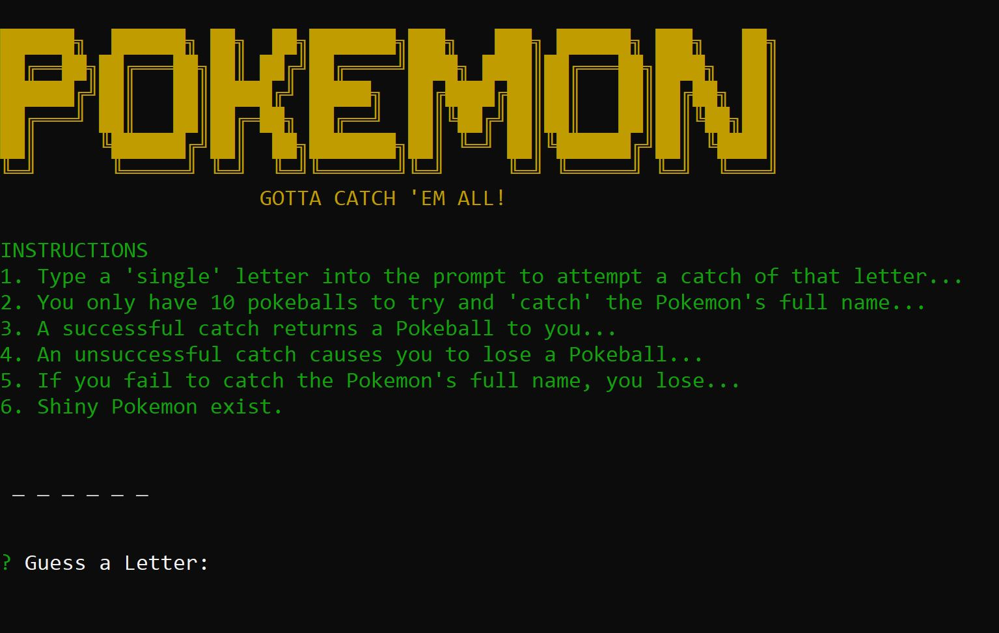

# word-guess-cli

Pokemon Word-Guess-Game 
version 1.0

NPM Packages Used
- inquirer
- pokemon
- chalk

Using the terminal/command-line while in the location of the directory app, simply type "node" followed by "./index.js" (no quotations please);

Instructions:
1. Type a 'single' letter into the prompt to attempt a catch of that letter...
2. You only have 10 pokeballs to try and 'catch' the Pokemon's full name...
3. A successful catch returns a Pokeball to you...
4. An unsuccessful catch causes you to lose a Pokeball... 
5. If you fail to catch the Pokemon's full name, you lose...
6. Shiny Pokemon exist.

EXTRA FEATURES:

+ FANCY Print methods, creating a more pleasurable viewing experience.

+ SHINY Pokemon
